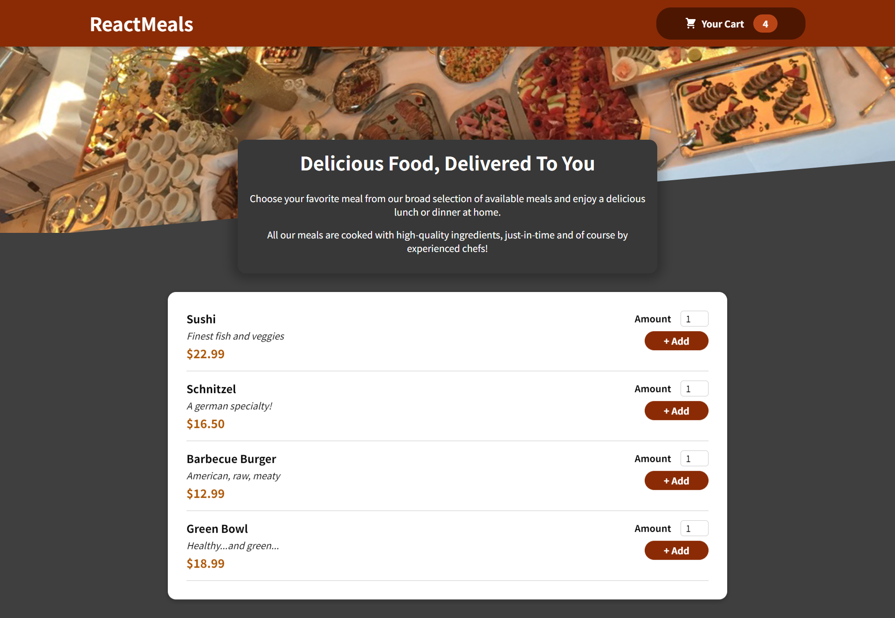
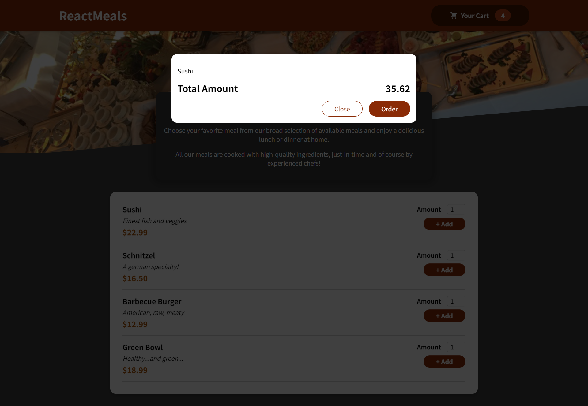

# Food Order App (I'm currently working on this app)
Welcome to the Food Order App! This React-based application allows users to conveniently browse a menu, place food orders, and have them delivered to their location.

## Features

- Browse a variety of food items.
- Customize food orders with options and preferences.
- Place orders securely.

### Installation
- git clone https://github.com/yourusername/food-order-app-react.git
- cd food-order-app
- npm install
- npm start

## Screenshots

